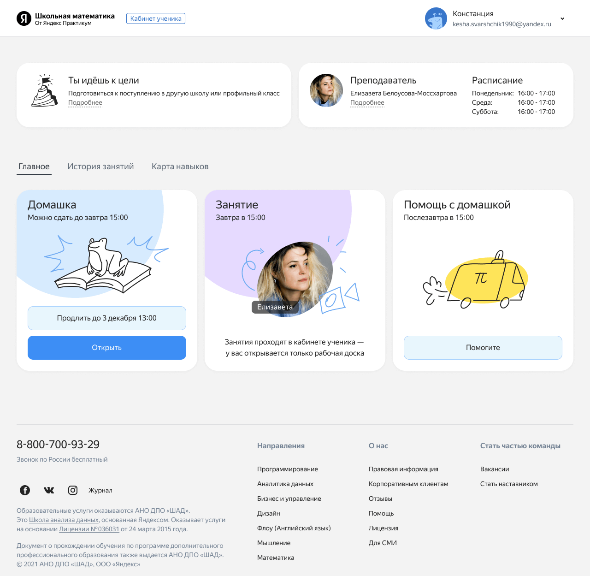
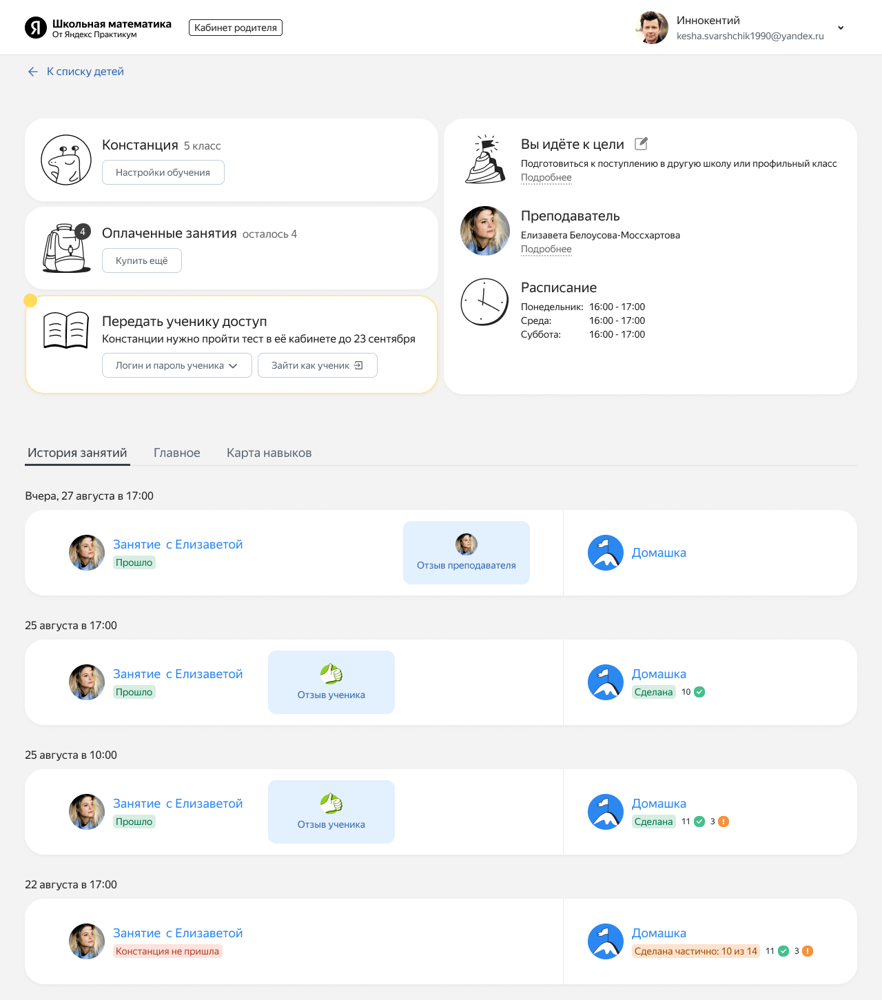
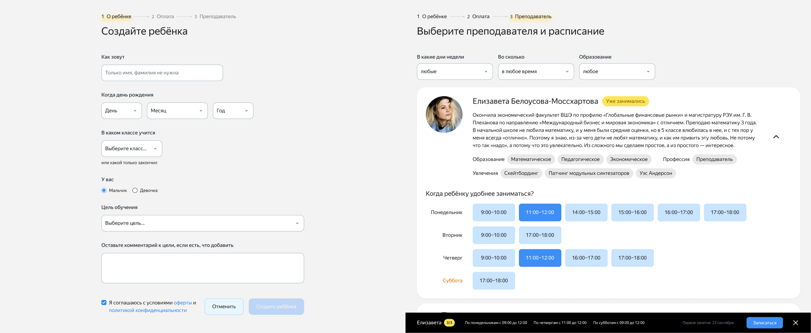

## About the company and the team

International training service for IT professions. Includes about 60 courses and many development teams. I used to work at the closed School Math product.

## Design process

1. Immersion in the problem, requirements gathering, analysis.
   I used product manager's research results, user flow, value stream map, frequency of use cases analysis, web analytics data and session records (Web-viewer from Yandex.Metrika).
2. Solution search.
3. UI detailing:
   Component assembly, documentation, elaboration of states, work with UX writer, reviews from other designers.
4. Development support.

## What I did

- Improved the interface, solved some of the user and business issues** in the personal accounts, face to face classes and homework, made the product scalable. Used the results of product manager research, user flow, value stream map, frequency of use cases analysis, web analytics data and session records (WebVisor from Yandex.Metrika).
- Was responsible for the design system and its development.
	- Unified components and styles: redesigned all the components into auto layout, made them reusable, got rid of custom elements to make the product easier to maintain and develop.
	- I also introduced design tokens. This way I was able to upload design updates faster and make the styles more consistent.
	- Made a consistent palette with the same perceived lightness of shades (through the OKLCH color model and taking into account the WCAG 3 guide).
	- Simplified component organization, created documentation.
- Simplified and reworked the onboarding process for parents and students.
- **Made the interface scalable** to add new features in the future and not rework existing solutions.
- **Improved styling**, reduced cognitive load by improving visual hierarchy and reading affordance. Improved the accessibility and readability of texts.
- **Communicated closely** with the development team, UX writer, three product designers, and illustrators.
- *Assisted other designers on the team:**with designing tutorial mechanics, assembling components, and teaching advanced techniques in Figma.
- **Presented design solutions** to the entire product team.
- **Actively participated in general activities** of the Workshop: process improvements, reviews, inclusive design movements.
- **Supported development** throughout development and testing.
- **Prepared a report on the UX maturity model** and human-centered design to improve design quality and reduce disputes in Workshop teams.
- *Created a plan for process, design, and component changes.
- **Developed team processes:**
	- Process for working on tasks and design sprints.
	- Facilitated transfer of layouts to development, hosted feedback sessions from Scrum team.

## Design layouts

[Figma, all layouts](https://www.figma.com/file/koqbtwzgUyo1IAzoFajOwZ/School-Math-v2.1?node-id=0%3A1)

Student’s dashboard:

Parent's dashboard:

This is how I describe the complex components and their states. I always annotate a non-obvious points.

Layout organisation. In the original Figma project, we divided the layouts into separate files.

## Examples from the design system

- Used a modular spacing system and complex nested components on auto layout.
- Implemented design tokens for consistency of styles and to quickly push changes to the extension. Used GitHub as a single source of truth.
- Created a palette based on perceived lightness of shades. Based on that, I created other styles, such as those for links.

